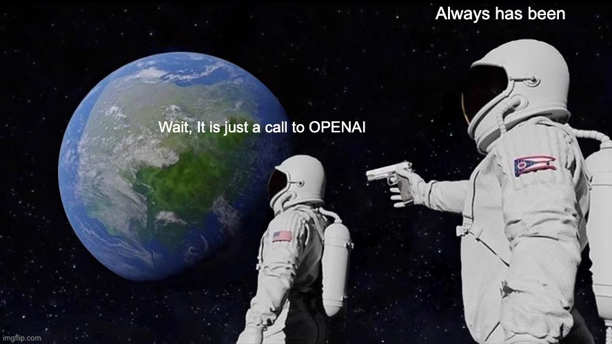

# AI-CLI

AI-CLI is a command-line interface (CLI) tool designed to help users find the best command for their terminal. It leverages the power of artificial intelligence to provide the most suitable command based on the user's input.

## How to Use

Actually used for my own personal use and to learn Rust, on MacOS with zsh.
I'm running LocalAI bare metal to avoid sending data to the cloud.

Every request sends:
- The current directory
- All available commands
- The env variables
- The 10 last shell commands
- The files in the current directory
- The question

## Build localy

1. Install a local AI endpoint.
2. Clone the repository.
3. Build the project.

```bash
cargo install --path cli
```

The endpoint and the model are configurable in `$HOME/.gpt-cli.toml`.

```toml
gpt_url="http://localhost:8080/v1/chat/completions"
model="llama3-8b-instruct"
```

Example : 
```bash
    ai get my public ip 
    >> curl -4 icanhazip.com
    >> Do you want to run this command ? (y/n):
    >> 81.XXX.XXX.XXX
```

```bash
    ./ai show all volumes
    >> diskutil list
    >> Do you want to run this command ? (y/n)
    >> /dev/disk0 (internal, physical): ...
```




## License

AI-CLI is licensed under the MIT License. See the `LICENSE` file for more details.
